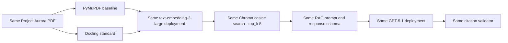

# Parse Before You Prompt

*Why Document Intelligence Is the Hidden Layer of Reliable RAG*

This companion project demonstrates how document representation changes conventional RAG while the downstream embedding, vector search, prompt, response schema, citation validation, and chat configuration remain fixed. A RAG system cannot reliably retrieve information that its ingestion pipeline failed to preserve.

## What this repository demonstrates

The baseline path is intentionally simple:

```text
PyMuPDF → native text → fixed 800-token windows → 100-token overlap
```

The primary path preserves document structure:

```text
DoclingDocument → layout/OCR/tables/pictures → HierarchicalChunker
→ HybridChunker → contextualized vector chunks → provenance
```

`HierarchicalChunker` supports inspection. `HybridChunker` produces the chunks indexed for retrieval.

## Controlled experiment



Held constant: source document, `text-embedding-3-large`, 3,072 dimensions, Chroma cosine distance, `top_k=5`, GPT-5.1, the RAG prompt/schema, and citation validator. The intended variable was document representation.

## Headline measured results

| Metric | Baseline | Docling standard |
|---|---:|---:|
| Recall@1 | 41.7% | 75.0% |
| Recall@3 | 91.7% | 91.7% |
| Recall@5 | 91.7% | 100.0% |
| MRR | 0.667 | 0.836 |
| Normalized answer match | 83.3% | 100.0% |
| Table-question accuracy | 75.0% | 100.0% |
| Precise provenance availability | 0% | 100% |
| Unsupported abstention | 100% | 100% |
| Mean evidence tokens/question | 1,913 | 495.21 |
| Mean total query latency | 3,178.50 ms | 2,959.57 ms |

These descriptive results come from one synthetic ten-page document, one completed evaluation pass, 14 questions (12 answerable and two unsupported), and 28 pipeline/question cases. They are not statistically significant.

## Strongest examples

For the OCR question “What is the maximum recovery window?”, baseline correctly abstained because the scanned fact never entered its index. Docling recovered **15 minutes** and linked the answer to precise page-8 provenance.

For the REQ-205 table question, baseline retrieved a broad relevant chunk but returned the wrong subsystem association. Docling preserved the Navigation + Analysis relationship and answered the multi-part question correctly.

## Application architecture

The runnable stack is Python 3.12, uv, FastAPI, Streamlit, PostgreSQL, Chroma, PyMuPDF, Docling 2.123.1, Azure `text-embedding-3-large`, and GPT-5.1.

- PostgreSQL is authoritative for documents, processing state, chunks, provenance, queries, citations, and evaluations.
- Chroma stores externally supplied vectors and search metadata; it does not generate embeddings.
- The filesystem holds the source PDF and local structured/visual artifacts.
- Streamlit talks only to FastAPI. FastAPI owns database, vector, filesystem, and Azure-provider access.

See [the architecture document](docs/architecture/architecture.md) for component and evidence-chain diagrams.

## Data boundary

Local: original PDFs, page images, table and picture crops, Docling JSON, parsing, PostgreSQL, Chroma, and evidence overlays.

Remote when configured: contextualized textual chunks for embedding; query text for query embedding; and the question plus retrieved textual evidence for answer generation. The application never sends the original PDF or visual artifacts to Azure OpenAI, but it would be inaccurate to claim that no data leaves the machine.

## Project Aurora

Project Aurora is a deterministic synthetic ten-page report containing document metadata, two-column text, nested headings, multi-page tables, a chart, an architecture diagram, a scanned OCR appendix, a formula, code, and distractors.

- [Synthetic PDF](demo/source/project_aurora_mission_readiness_report.pdf)
- [Ground truth](demo/ground_truth.json)

## Quick start

Prerequisites: Python 3.12, [uv](https://docs.astral.sh/uv/), Docker Desktop or Docker Engine, enough disk/RAM for local Docling models, and optional Azure OpenAI access for live embedding/RAG/evaluation calls.

```powershell
uv sync --locked
docker-compose up -d
uv run alembic upgrade head
uv run python scripts/prefetch_docling_models.py
Copy-Item .env.example .env
```

Configure `.env` with **your own** Azure OpenAI resource and deployment names if you want live embeddings, RAG, or evaluation. The PostgreSQL password in `docker-compose.yml` is a local-demo-only default.

Start both applications:

```powershell
./scripts/start_demo.ps1
```

Or start them separately:

```powershell
./scripts/start_api.ps1
./scripts/start_ui.ps1
```

Docling model prefetch downloads several GB. High-quality CPU conversion can be slow; the measured Aurora conversion took about 32.6 minutes on the evaluation machine, and your timing will differ.

## Running without Azure

Without Azure access you can inspect the source code, architecture, Project Aurora, sanitized reference results, screenshots, charts, and article. Local processing supports `index_mode=skip`, which performs conversion without embeddings or Chroma writes. The complete RAG benchmark cannot be rerun without embedding and chat deployments.

## Running the controlled evaluation

Dry-run validates configuration, source/ground-truth identities, compatible indexed runs, and 28-case coverage without model calls:

```powershell
./scripts/run_evaluation.ps1 `
  -DocumentId <document-uuid> `
  -BaselineProcessingRunId <baseline-run-uuid> `
  -DoclingProcessingRunId <docling-run-uuid> `
  -DryRun
```

The full command makes live Azure model calls and requires compatible baseline and Docling indexes:

```powershell
./scripts/run_evaluation.ps1 `
  -DocumentId <document-uuid> `
  -BaselineProcessingRunId <baseline-run-uuid> `
  -DoclingProcessingRunId <docling-run-uuid> `
  -Execute
```

The Python entry point is `scripts/run_evaluation.py`. Do not selectively rerun questions to improve results.

## Reference results

- [Evaluation summary](docs/results/evaluation-summary.md)
- [One-row-per-case CSV](docs/results/reference-evaluation.csv)
- [Structured JSON](docs/results/reference-evaluation.json)

These sanitized outputs let readers inspect the completed benchmark without Azure access.

## Demo walkthrough

Follow the [five-minute demo walkthrough](docs/demo-walkthrough.md).

## Known limitations

- One synthetic ten-page document and one evaluation pass are descriptive, not universal.
- Docling CPU conversion was slow; hierarchy and some vertical table merges remained imperfect.
- Picture descriptions are derived aids, not verbatim source evidence.
- Table-header repetition was configured but not exercised.
- The baseline has only three broad chunks, so Recall@5 is a weak discriminator.
- Citation integrity is not semantic entailment; provenance does not eliminate hallucination.
- Recall@3 tied; baseline table-category MRR was higher; baseline broad page/range overlap scored higher than Docling's strict citation-page metric.
- Granite-Docling-258M was not evaluated.

See [limitations](docs/limitations.md) for details.

## Companion article

- [Repository article source](docs/blog/parse-before-you-prompt.md)
- Continuum web article URL: **to be added after publication**
- Companion repository: https://github.com/tprem2002/parse-before-you-prompt

## License

An open-source/public-use license has not yet been selected. See [LICENSE_PENDING.md](LICENSE_PENDING.md). License selection is required before public release when redistribution rights need to be explicit.
