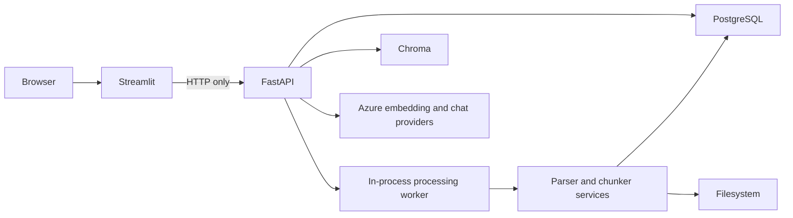
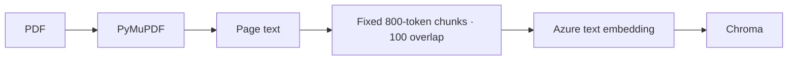
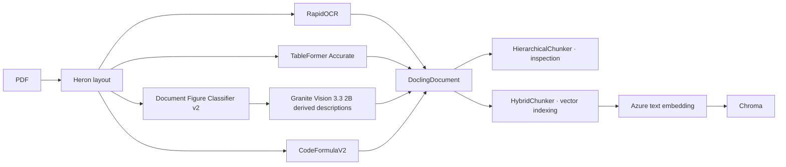
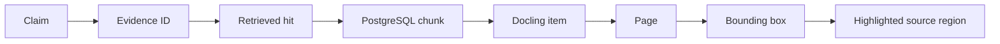

# Architecture

## Application components

Streamlit is presentation only. It does not connect directly to Azure OpenAI, PostgreSQL, Chroma, or artifact storage. FastAPI owns those boundaries and persists authoritative state before exposing it to the UI.

## Baseline ingestion

PyMuPDF extracts native text. The baseline does not run OCR or reconstruct table structure. It produced three broad chunks for Project Aurora and records coarse page ranges rather than bounding boxes.

## Docling standard ingestion

Docling 2.123.1 runs locally with `enable_remote_services=False`. `HierarchicalChunker` exposes document structure for inspection, while `HybridChunker` produces contextualized vector chunks under an 800-token limit. Project Aurora yielded 47 hierarchy chunks, 25 indexed Hybrid chunks, ten peer merges, zero production splits, a maximum contextualized size of 364 tokens, and 130 provenance regions. Picture descriptions are derived aids and remain labeled separately from source evidence.

## Evidence chain

Evidence IDs are deterministic within a response. The citation validator accepts only IDs backed by retrieved chunks. Filenames, pages, Docling references, and bounding boxes come from stored metadata—not model prose.

## Storage roles

- PostgreSQL: authoritative documents, processing/evaluation runs, chunks, provenance, query records, retrieval hits, and artifact metadata.
- Chroma: externally supplied vectors and search metadata in separate pipeline collections.
- Filesystem: source PDFs, lossless Docling JSON, Markdown, rendered pages, table/picture crops, manifests, and overlays.

## Background processing

An upload creates a persisted `ProcessingRun`. One bounded in-process worker claims queued PostgreSQL work, updates stage/progress fields, and persists completion or safe failure. Startup recovery returns stale in-progress work to a recoverable state. This keeps API requests responsive but is intentionally not a distributed production queue.

## Security and data boundary

The original PDF, visual artifacts, local conversion, PostgreSQL data, and Chroma data remain local. Only textual chunk representations and query text are sent for embeddings; answer generation receives the question and retrieved textual evidence. Users supply their own Azure OpenAI resource. The local demo is unauthenticated and must not be exposed publicly without production hardening.
