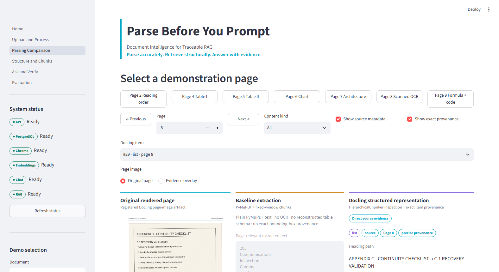
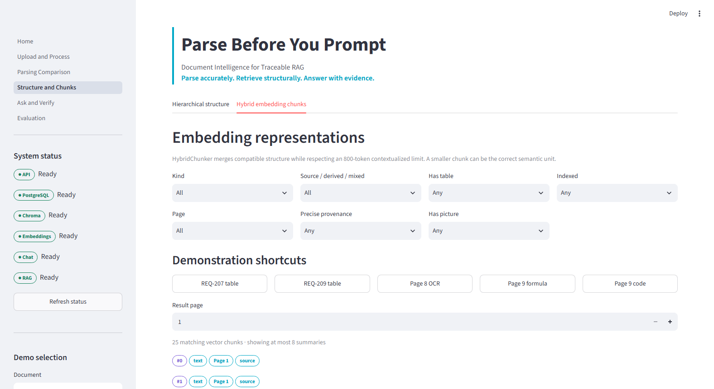
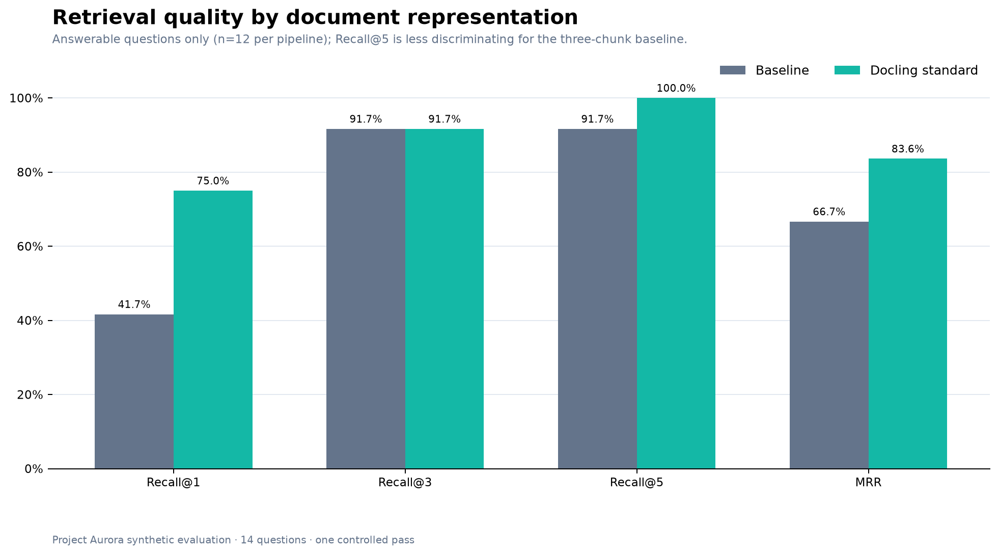
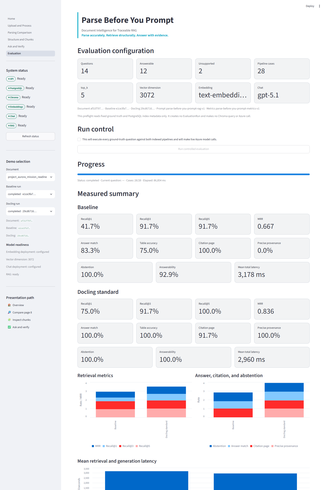
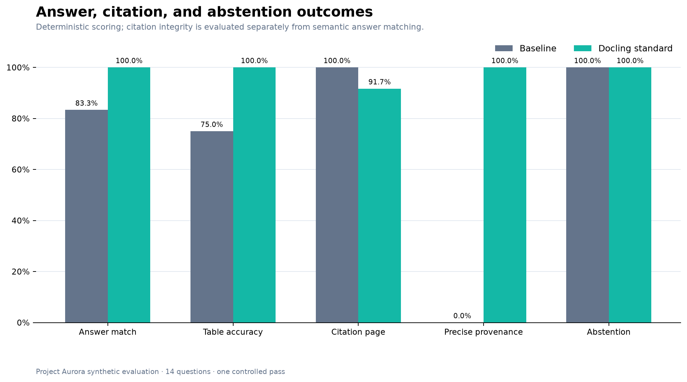
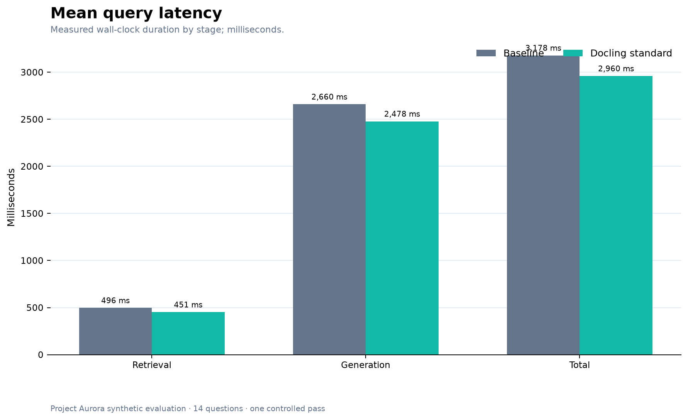
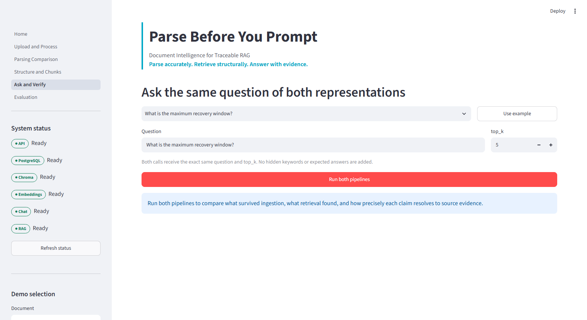

# Parse Before You Prompt: Why Document Intelligence Is the Hidden Layer of Reliable RAG

*A controlled comparison on one synthetic ten-page mission-readiness report.*

A RAG system cannot retrieve information that parsing failed to preserve. That sounds obvious, yet teams often tune prompts, swap models, or add retrieval tricks before inspecting the representation entering the index. The model never sees the page humans see. It sees extracted text, chunks, metadata, and whatever relationships survived conversion.

Project Aurora isolates that hidden layer. The same PDF went through two paths: a PyMuPDF baseline with three fixed token-window chunks, and a local Docling standard-quality pipeline. Everything downstream was held constant: the same `text-embedding-3-large` deployment, 3,072 dimensions, Chroma cosine retrieval, top-k 5, GPT-5.1 deployment, system prompt, structured answer schema, citation validator, abstention contract, and retry policy. The intended variable was document representation—not the model.

## Representation before retrieval

The local Docling standard pipeline used Heron layout, RapidOCR, TableFormer Accurate, Document Figure Classifier v2, Granite Vision 3.3 2B derived descriptions, and CodeFormulaV2.

Docling converts the PDF into a `DoclingDocument`: a typed structure for headings, paragraphs, tables, pictures, captions, and source provenance rather than one undifferentiated text stream. `HierarchicalChunker` produced 47 inspection chunks that made the recovered hierarchy visible. `HybridChunker` produced 25 contextualized chunks for vector indexing. Ten compatible peers merged, none required splitting, and the largest contextualized chunk was 364 tokens under the 800-token ceiling.

For REQ-205, structured conversion preserved the Navigation + Analysis association that the baseline answered incorrectly. REQ-207 and REQ-209 provide additional table-preservation examples.

The runnable architecture keeps a strict boundary: browser → Streamlit → FastAPI. FastAPI owns the PostgreSQL processing queue, parser/chunker services, externally supplied Chroma vectors, Azure providers, and local artifacts. A supported claim resolves through evidence ID → retrieval hit → stored chunk → Docling item → page → bounding box → optional highlighted overlay.

That structure mattered in several ways. Local OCR recovered a “15 minutes” value absent from the baseline extraction. Structured table serialization retained the important REQ-207 and REQ-209 associations. Pictures and captions remained addressable. Source text stayed distinct from generic, derived picture descriptions, so a generated visual summary could help retrieval without masquerading as verbatim evidence. Across the indexed Docling chunks, 130 stored provenance regions connected evidence to document items, pages, and bounding boxes.

The result was not a perfect parse. Heading reconstruction had imperfections; some vertical table merges were not reconstructed; picture descriptions were generic; and header repetition, although supported, was not exercised because production table chunks fit under 800 tokens. CPU conversion and chunking took 1,954,758 ms—about 32.6 minutes—for this one ten-page document. The baseline extraction took 52 ms. Quality was purchased with substantial preprocessing time.

## What the controlled evaluation measured

Fourteen ground-truth questions—12 answerable and two unsupported—ran once against both existing indexes, baseline first and Docling second for each question. Relevance was deliberately strict: a chunk needed expected-page overlap *and* all normalized expected terms. Broad baseline page ranges alone did not qualify. Answers were graded with deterministic normalization and complete accepted alternatives; no LLM judge, reranking, selective rerun, or manual evidence injection was used.

Docling’s Recall@1 was 75.0% versus 41.7% for baseline, and MRR was 0.836 versus 0.667. Recall@3 tied at 91.7%; Recall@5 was 100.0% versus 91.7%. Recall@5 is a weak discriminator here because baseline has only three broad chunks, making rank-one behavior and MRR more informative. The baseline’s single representation miss was the OCR-only recovery-window question. Docling retrieved it at rank one.

Docling matched all 12 answerable ground-truth alternatives; baseline matched 10, for 100.0% versus 83.3%. Table-question accuracy was 100.0% versus 75.0%. Both branches correctly abstained on both unsupported questions and achieved 100% citation-ID/structure integrity among supported answers.

Those headline numbers need nuance. Baseline citation-page accuracy was 100% for its 11 supported answers, while Docling scored 91.7% because one correct table answer’s claims did not all cite an expected page. Baseline also exceeded Docling on table-category MRR, 0.750 versus 0.508. But baseline’s citations were broad page ranges and its precise-provenance rate was 0%. Docling’s was 100%: every supported answer offered at least one real, stored bounding box. Citation integrity still does not prove entailment, and provenance does not eliminate hallucination; it makes verification possible.

Query-time efficiency favored Docling modestly. Mean total latency was 2,960 ms versus 3,179 ms, and total chat tokens were 15,325 versus 33,974. Docling retrieved five smaller, contextualized chunks per question but averaged only 495 evidence tokens; baseline’s three broad chunks averaged 1,913. Parsing was slower, but the resulting query context was much leaner.

## The data boundary is part of the design

Docling conversion occurs locally with remote services disabled. Original PDFs, page images, table crops, picture crops, and Docling JSON remain local. Contextualized chunk text is sent to the user's configured Azure OpenAI boundary for embedding. At question time, query text goes to the same embedding deployment, while only the question and retrieved textual evidence go to the configured GPT-5.1 deployment. It would be inaccurate to claim that no data leaves the machine; the boundary is selective and explicit.

## The practical conclusion

On this document, Docling improved rank-one retrieval, answer matching, table-answer accuracy, precise provenance, token use, and mean latency. It did not win every metric, and this sample is far too small for universal claims. Granite-Docling-258M was intentionally not evaluated.

The stronger conclusion is architectural: prompt quality cannot repair missing OCR, flattened table relationships, or absent source coordinates. Before optimizing the prompt, inspect what the model is being asked to understand. Parse accurately. Retrieve structurally. Answer with evidence.

## Sources and method

The runnable companion repository is available at [tprem2002/parse-before-you-prompt](https://github.com/tprem2002/parse-before-you-prompt).

<!-- Replace this URL if the final GitHub organization/repository name differs. -->

- [Docling documentation — features and local execution](https://docling-project.github.io/docling/)
- [DoclingDocument concepts](https://docling-project.github.io/docling/concepts/docling_document/)
- [Docling native chunking](https://docling-project.github.io/docling/concepts/chunking/)
- [Docling provenance reference](https://docling-project.github.io/docling/reference/docling_document/)
- [Microsoft Learn — Azure OpenAI embeddings](https://learn.microsoft.com/en-us/azure/foundry/openai/how-to/embeddings)

Method note: all numeric findings come from one completed controlled Project Aurora evaluation. This is one synthetic ten-page document, 14 questions, and one pass. Results are descriptive, not statistically significant or a universal parser ranking.
